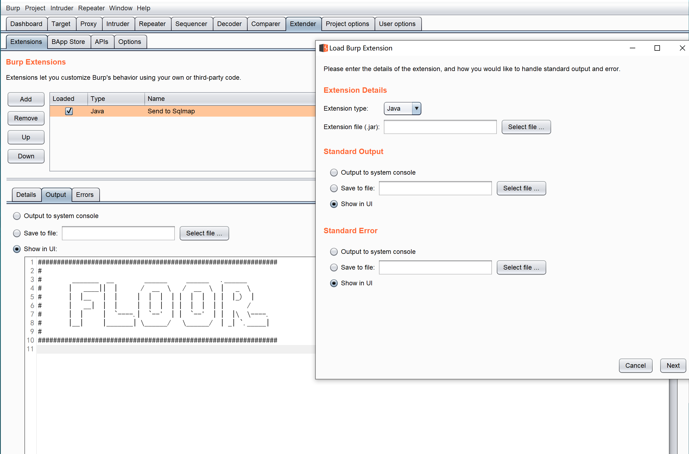
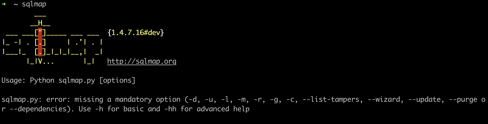
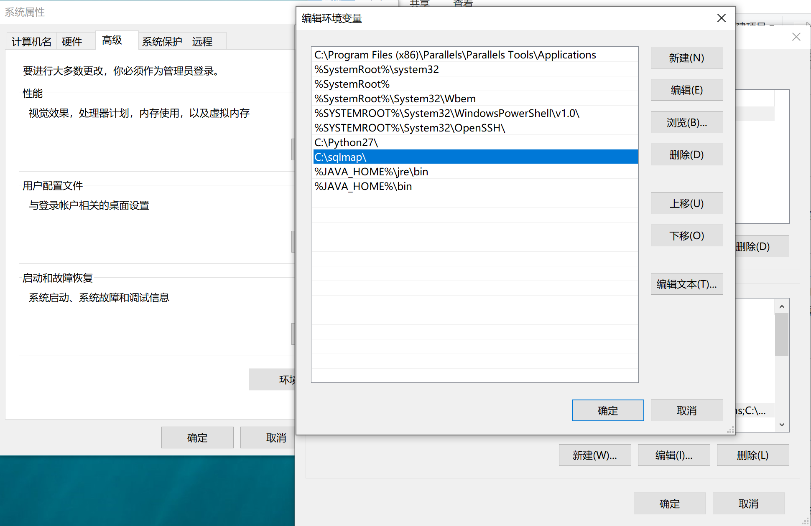
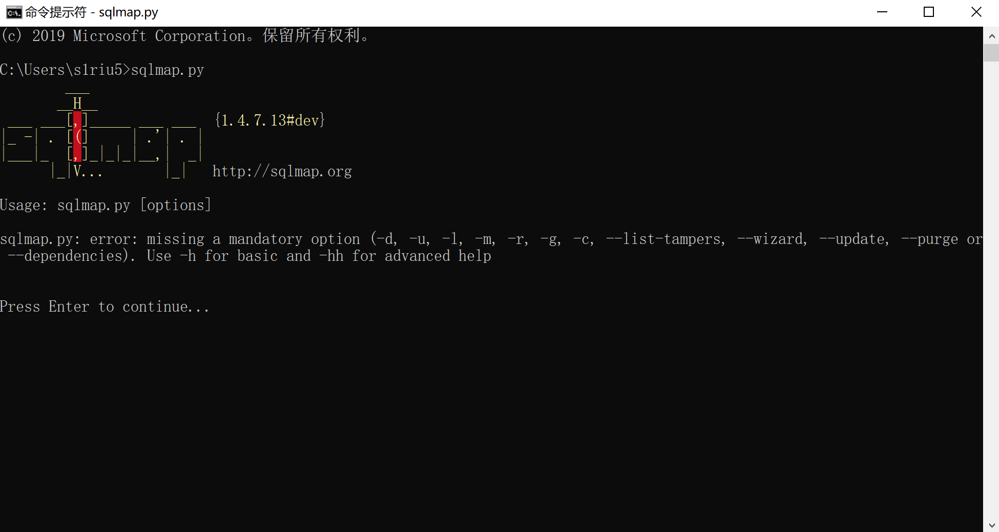
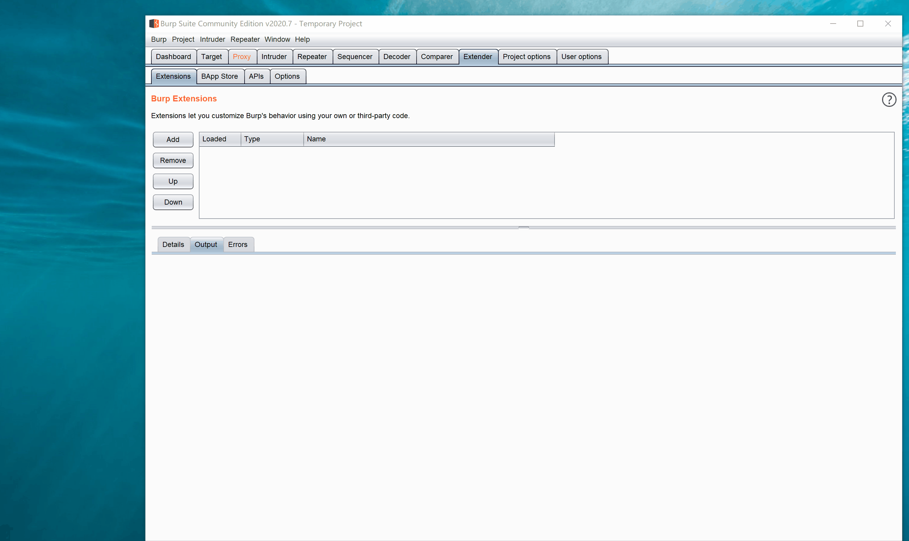

# The Floor(愚者)

## 0x01 🚀 简介
这个burpsuite插件的作用是联动sqlmap和burpsuite，通过右键直接将http请求发送给sqlmap进行测试，该插件跨平台支持Windows,Linux以及macOS

## 0x02 安装

首先从github下载floor.jar,然后让burpsuite加载floor.jar



### 0x001 macOS

如果没有安装sqlmap，首先安装

```shell
git clone https://github.com/sqlmapproject/sqlmap.git /usr/local/share/sqlmap/
touch /usr/local/bin/sqlmap
chmod a+x /usr/local/bin/sqlmap
```

将以下内容写入 /usr/local/bin/sqlmap
```shell script
#!/bin/bash

cd /usr/local/share/sqlmap/ && ./sqlmap.py "$@"
```

这样就可以实现sqlmap直接在终端运行了



然后在burpsuite的Proxy中右键"Send To Sqlmap"即可调用sqlmap自动测试目标网站


### 0x002 Windows

首先请安装好Python2.7，并且配置好环境变量，然后下载sqlmap,比如我的sqlmap下载后放到C盘根目录，那么sqlmap的安装路径就是C:\sqlmap
将sqlmap的路径添加到环境变量Path中。以Windows10为例



可以在cmd中直接运行sqlmap.py



在Burpsuite的http请求中直接右键




### 0x003 Linux
以Kali为例，kali中比较简单，sqlmap已经提前加到环境变量中了，可以直接右键运行


## 0x02 💀注意

>1. http文件放在和burp同级下的sqlmap目录中
>2. 右键之后sqlmap的执行语句会自动放到粘贴板中
>3. 编译jar时用的JAVA版本是11.0.7


## 0x03 📜免责声明

本工具仅能在取得足够合法授权的企业安全建设中使用，在使用本工具过程中，您应确保自己所有行为符合当地的法律法规。 如您在使用本工具的过程中存在任何非法行为，您将自行承担所有后果，本工具所有开发者和所有贡献者不承担任何法律及连带责任。 除非您已充分阅读、完全理解并接受本协议所有条款，否则，请您不要安装并使用本工具。 您的使用行为或者您以其他任何明示或者默示方式表示接受本协议的，即视为您已阅读并同意本协议的约束。
